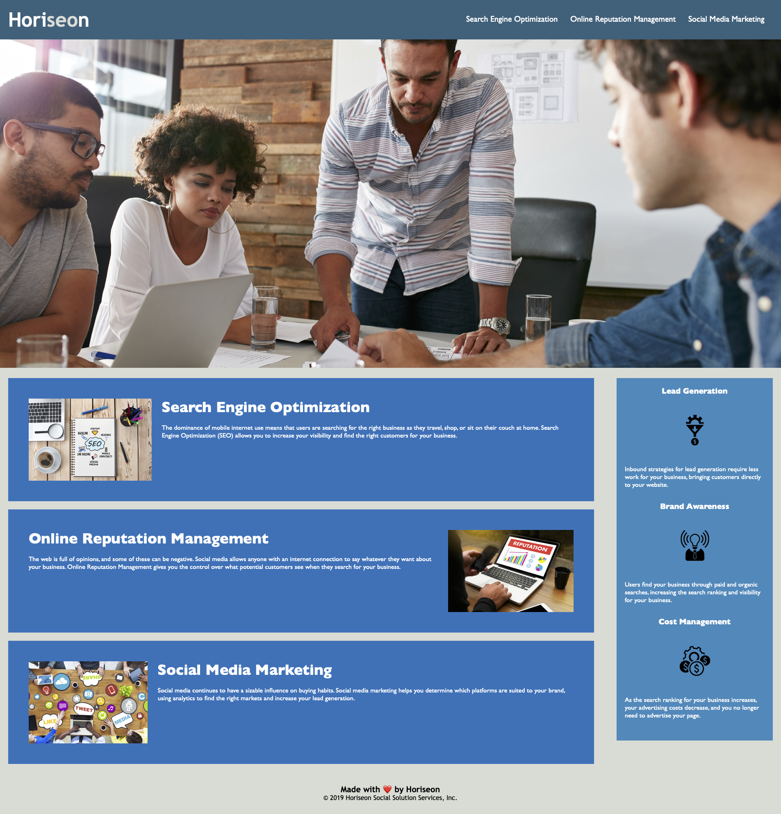

# Week-1-Challenge

## Description

The purpose of this project was to refractor the Horiseon webpage to make it more accessible. Having a more accessible website ensures that people with disbilities can still access the website using assistive technolgies and it improves a websites position with search engines such as Google. In order to make the website more accessible I ensured the HTML followed in a logival order and ustilised semantic elements. I condensed the CSS to make it more efficient and ensured it was organised following the semantic structure of the HTML elements. I also added 'alt' attributes to all images and icons.

Through this project I learnt the importance of accesibility and using semantic HTML. I also learnt how to make CSS more efficient by condensing the code.

## Installation

The website can be accessed [here]()

## Usage

A screenshot of the website can be seen below

## Credits

N/A

## License

N/A